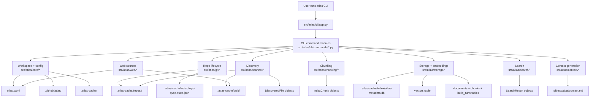
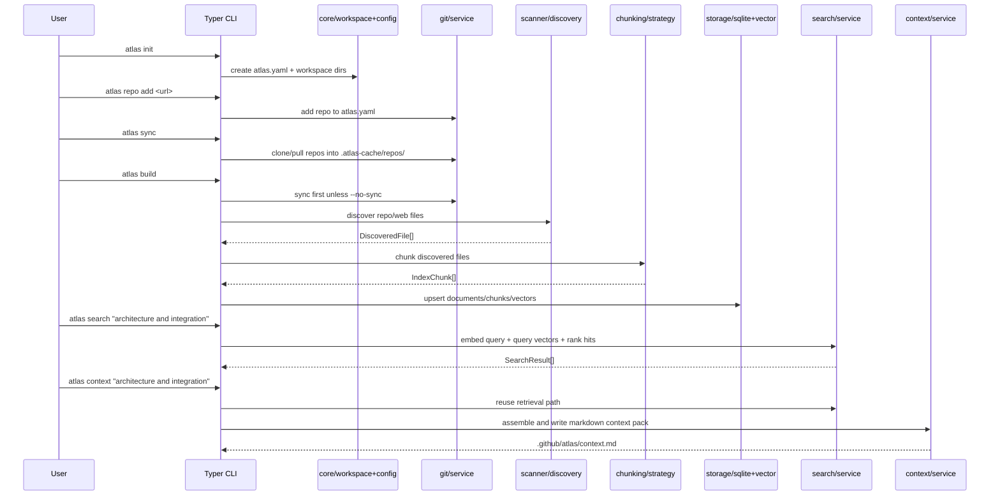

# Atlas Architecture Diagram

This document explains how Atlas is structured so you can connect the CLI commands to the codebase quickly.

## System View

## Layered View

1. CLI layer
   - `src/atlas/cli/app.py` wires Typer commands.
   - `src/atlas/cli/commands/*.py` parses arguments, calls one service, prints output.

2. Core layer
   - `src/atlas/core/workspace.py` detects the workspace root and creates the expected folders.
   - `src/atlas/core/config.py` loads and saves `atlas.yaml`.
   - `src/atlas/core/models.py` defines config models like `AtlasConfig`, `RepoConfig`, and `WorkspacePaths`.

3. Repo management layer
   - `src/atlas/git/service.py` handles repo registration, removal, and sync orchestration.
   - `src/atlas/git/client.py` is the thin subprocess wrapper around `git clone`, `git fetch`, `git checkout`, `git pull`, and `git rev-parse`.
   - `src/atlas/git/manifest.py` reads and updates repo entries in `atlas.yaml` and writes sync state.

4. Indexing pipeline layer
   - `src/atlas/scanner/discovery.py` walks repo and web cache files and turns them into `DiscoveredFile` records.
   - `src/atlas/scanner/filtering.py` decides what to skip and classifies files as markdown/html/config/code/text.
   - `src/atlas/chunking/strategy.py` turns files into section-aware `IndexChunk` objects.
   - `src/atlas/storage/pipeline.py` persists metadata and vectors for each chunk.

5. Retrieval layer
   - `src/atlas/storage/sqlite_store.py` owns the SQLite DB and schema bootstrap.
   - `src/atlas/storage/repositories.py` reads and writes metadata tables.
   - `src/atlas/storage/vector_store.py` stores vectors and performs similarity scoring.
   - `src/atlas/storage/embedding.py` defines the embedding boundary and the local `HashEmbeddingClient` used in MVP.

6. Presentation layer
   - `src/atlas/search/service.py` runs query embedding, vector search, metadata fetch, and ranking.
   - `src/atlas/search/ranking.py` applies architecture-first boosts and categories.
   - `src/atlas/search/formatter.py` renders terminal search output.
   - `src/atlas/context/service.py`, `assembler.py`, and `writer.py` convert ranked results into `.github/atlas/context.md`.

7. Web ingestion layer
   - `src/atlas/web/registry.py` registers URLs in `atlas.yaml`.
   - `src/atlas/web/ingest.py` fetches raw HTML into `.atlas-cache/web/`.

## End-to-End Runtime Flow

## Workspace Artifacts

- `atlas.yaml`
  - Source of truth for workspace settings, registered repos, and registered web sources.
- `.atlas-cache/repos/`
  - Local clones for registered repositories.
- `.atlas-cache/web/`
  - Raw HTML snapshots and ingest metadata.
- `.atlas-cache/index/atlas-metadata.db`
  - SQLite metadata store containing repos, documents, chunks, vectors, and build runs.
- `.atlas-cache/index/repo-sync-state.json`
  - Last synced commit information per repository.
- `.github/atlas/context.md`
  - Generated AI-ready context pack.

## Key Design Decisions Visible In Code

- Architecture-first retrieval is implemented in ranking, not only in documentation.
  - `src/atlas/search/ranking.py` boosts docs, README content, config wiring, and section context.
- Embeddings are abstracted behind an interface.
  - `src/atlas/storage/embedding.py` keeps the MVP local while preserving a provider boundary.
- `build` is the main integration command.
  - It ties together sync, discovery, chunking, embedding, metadata persistence, and vector persistence.
- `search` and `context` share the same retrieval core.
  - `context` is effectively `search` plus assembly and markdown writing.

## Best Files To Read First

1. `src/atlas/cli/app.py`
2. `src/atlas/cli/commands/build.py`
3. `src/atlas/git/service.py`
4. `src/atlas/scanner/discovery.py`
5. `src/atlas/chunking/strategy.py`
6. `src/atlas/storage/pipeline.py`
7. `src/atlas/search/service.py`
8. `src/atlas/search/ranking.py`
9. `src/atlas/context/service.py`
